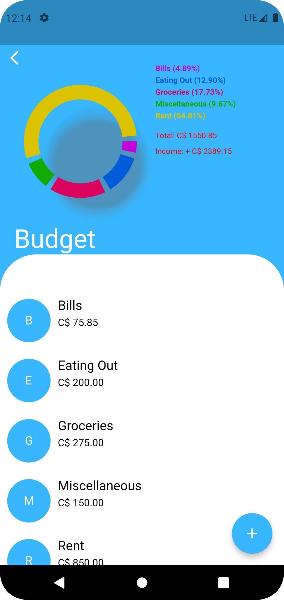
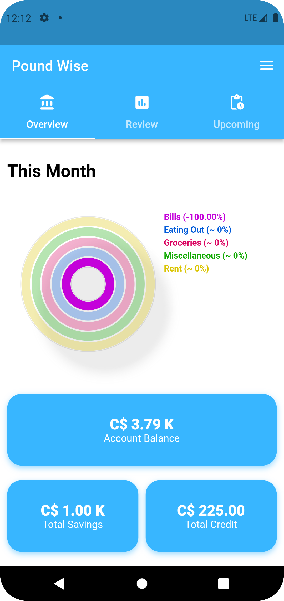
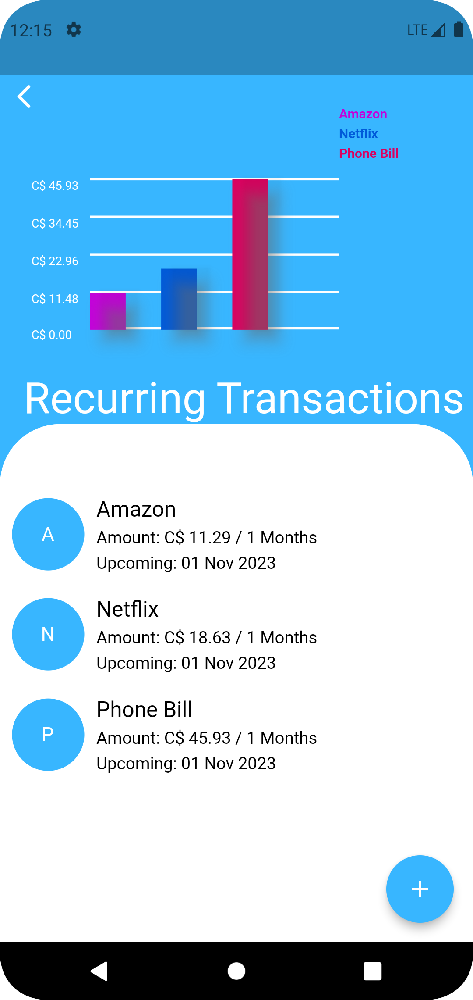
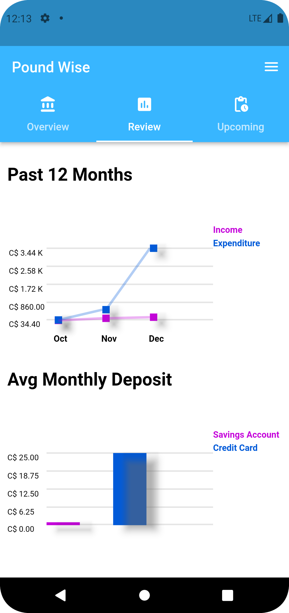
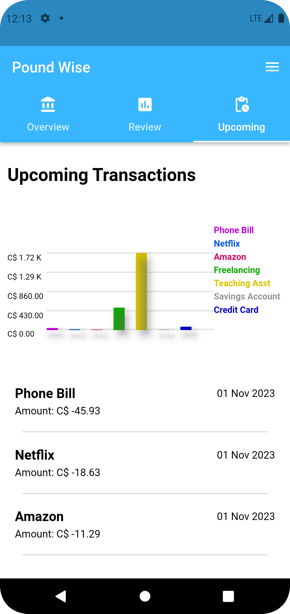

# MAthGraphs Flutter Package

MAthGraphs is a Flutter Dart package that simplifies the process of adding and customizing various
graphs to your cross-platform Flutter applications. The package is designed to be user-friendly and
allows you to quickly integrate pie graphs, bar graphs, scatter graphs, and ring graphs into your
application. These graphs seamlessly scale to the available space, providing a responsive and
visually appealing data visualization solution.

 &nbsp
 &nbsp
 &nbsp
 &nbsp


## Installation

To use MAthGraphs in your Flutter project, add the following dependency to your `pubspec.yaml` file:

```yaml
dependencies:
  git:
    url: https://github.com/kaycee-okoye/math_graphs.git
```

Then, run:

```bash
$ flutter pub get
```

## Usage

To get started, import the MAthGraphs package in your Dart file:

```dart
import 'package:math_graphs/math_graphs.dart';
```

## Folder Structure

The project is organized into the following folders:

- **Graphs:** Contains the widgets used to generate graphs.
- **Constants:** Contains UI/UX constants used throughout the package.
- **Extensions:** Contains common extensions applied to the objects in the package.
- **Models:** Contains data classes used to pass information to be plotted to the graphs.

## Contribution Guidelines

Please refer to the [CONTRIBUTING.md](CONTRIBUTING.md) file for detailed information on how to
contribute to this project.

## License

This project is licensed under the MIT License - see the [LICENSE.md](LICENSE.md) file for details.